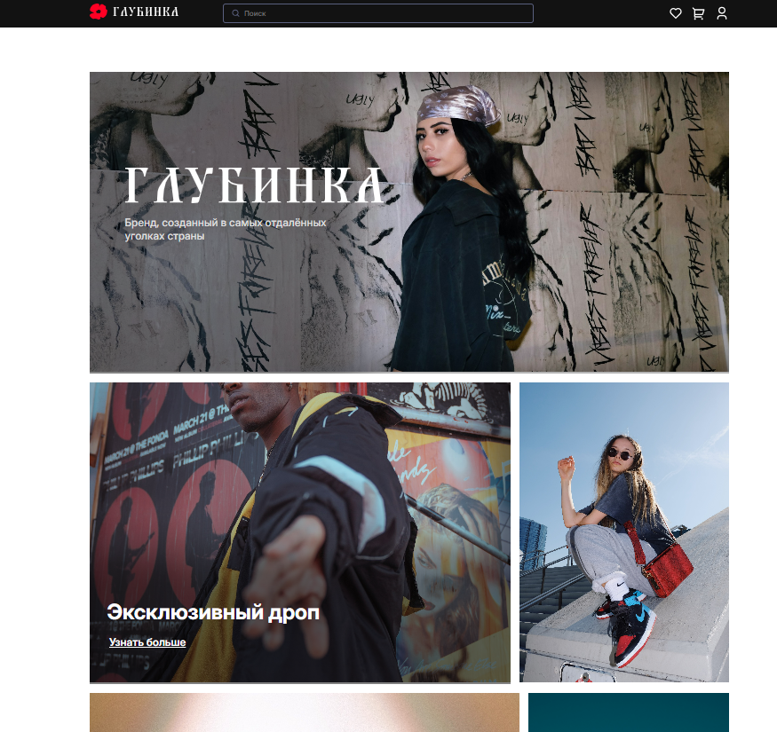
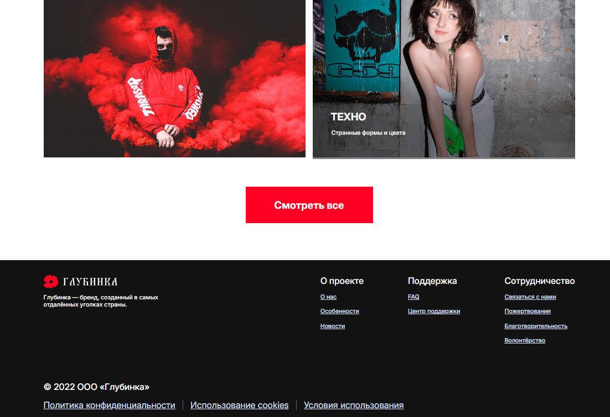
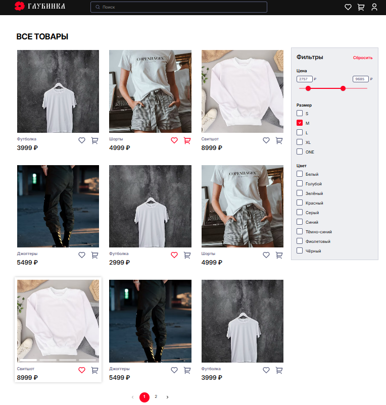
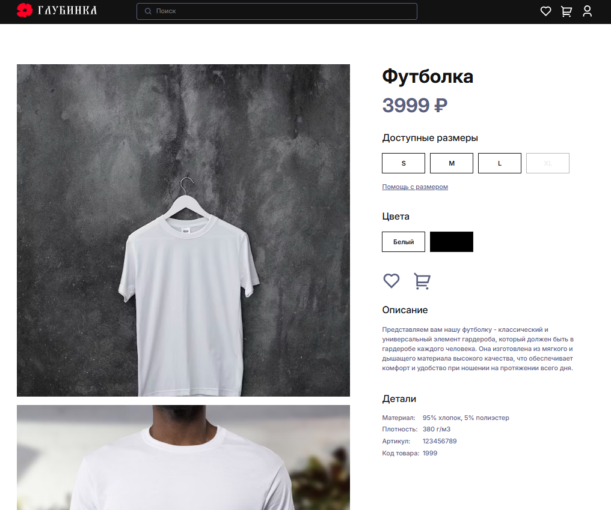

# О проекте

Данный проект - это сайт стритвир-бренда Глубинка

## Использованные технологии

- React
- TypeScript
- Redux
- Redux Saga
- json-server
- Material UI

## Установка и запуск (локально)

Установить зависимости:

```bash
npm install
```

Запуск проекта:

```bash
npm run start
```

## Превью страниц

### Главная страница

#### Header



#### Footer



### Список товаров с фильтрацией



### Карточка товара


